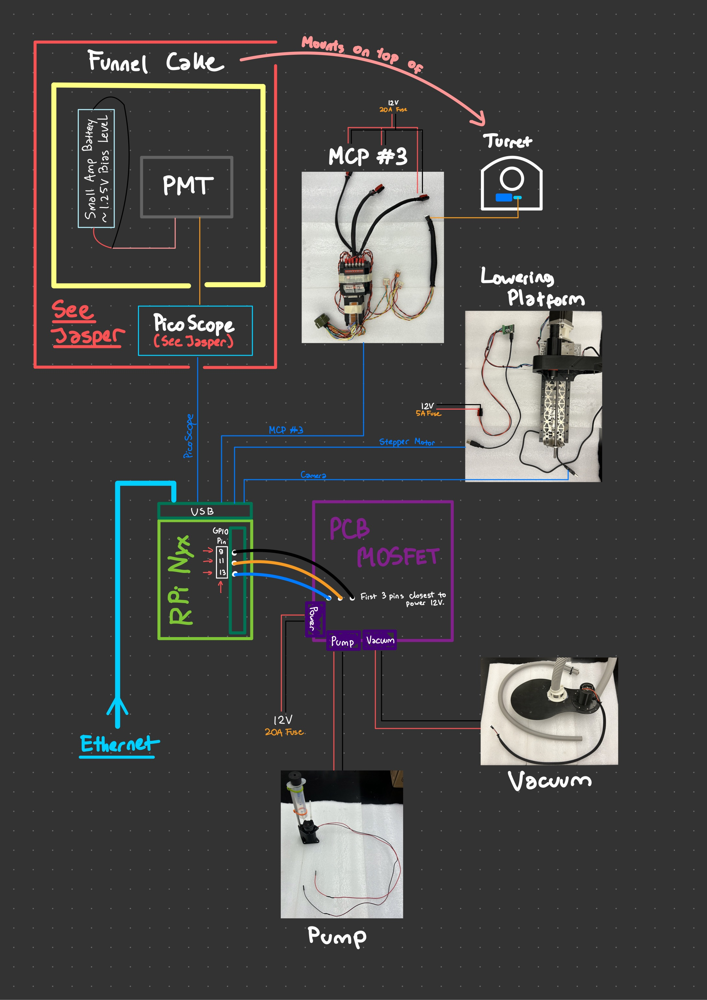

# Science Testing - May 21st, 2023

## Things to check:
- The Funnel Cake and ATP testing chamber is mounted on the turret properly and is able to rotates to each five funnels under a singular channel for soil and water deposition and positions cuvettes. The testing chamber **NEEDS TO BE** is light-sealed, ensuring that **NO** outside light goes in and annihilate our extremely photon-sensitive PMT.

- Make sure the Lowering Platform is in the front of the rover, with:
    + Camera
    + UV Flashlight
    + Light-blocking shroud
    + Vacuum tube connected to the ATP Apparatus
    + ***NOTE:*** The platform will NOT lowered all the way down because Sawyer recently change the height of the shroud. So the bounds in which the Lowering Platform lowers to needs to extend a little more since it is too short rn, keep that in mind. I will fix that when I have that chance.

- Make sure everything is connected to **Nyx**, Raspberry Pi, and the MOSFET circuit. Below is an img of how it should look on the rover:




## Components:
#### Nyx:
    - Ethernet (duh)
    - USB:
        + MCP #3
        + Tic36v4 - Stepper Motor (part of Lowering Platform)
        + Lowering Platform Camera
        + PicoScope (Not set up, wait for Jasper, please don't fry the PMT...)
    - GPIO Pins:
        + 9 (Ground) goes to Ground on PCB Mosfet (should be 3rd from closest power port)
        + 11 goes to the middle of the 3 (controls Vacuum)
        + 13 goes to pump, should be the first.
        + Writing from memory so double check with Tyler, or cross check with a fried Mosfet I have laying around over on the table Jacob and Liam usually sits.
#### MOSFET:
    - Power --> 12V [20A Fuse blade] <-- Double check
    - Pump/Vacuum wire is screwed in properly from terminal
#### Tic36v4:
    - Power --> 12V [5A Fuse]
#### Lowering Platform
    - Camera --> Nyx USB port
    - UV Light (Should be on before starting the mission)
    
- Make sure the Stepper Motor is ***DE-ENERGIZED*** after every usage!!!! If you hear the stepper motor running and the program is not running or off. **KILL 12V POWER**

#### MCP
    - Power --> 12V [20A Fuse]
    - We only need MCP #3, so make sure that's properly connected to Nyx, and to the turret.


## Notes:
- Check the ***Yellow note*** I taped and left on Helios, do those.
- I'm pretty sure I mounted the Lowering Platform but without the shroud, UV Flashlight, and the camera *(not connected to Nyx)*. So make sure to put those together and connect the camera to Nyx.
- We won't be doing PMT testing unless the Funnel Cake is printed, light-sealed and ready to go. But we should do this last when I get 1pm - 4pm to set it up as I wasn't able to do so today Saturday.
- Use common sense: If something is smoking, kill power. If something is off, kill power.

## Science Package Code
### General build:
Build packages
```bash
cd ~/science_2022_23
make          # colcon build all
```
Clean packages
```bash
make clean    # clean all
```

### Science Package (Turret, Lowering Platform, Pump, Vacuum):
Nyx's Terminal
```bash
make srv      # run server that will take actions upon request
```
Cameron hot ass sexy computer's Terminal
```bash
make cli c={} t={} # run client that will send request to server
```
where `c` is the command and `t` is the target/time. `t` should be defaulted to 0 if usage is not specified (for `c` = `1`,`2`).

##### Commands (`c`):
- `1` - Lower Lowering Platform for UV Experiment *(Include `t=0` by default)*
- `2` - Raise Lowering Platform for UV Experiment *(Include `t=0` by default)*
- `3` - Start Water Pump/Dispenser *(for `t` seconds)*
- `4` - Start Vacuum Pump *(for `t` seconds)*
- `5` - Rotate Funnel Cake into position with given targeted index `t`:*[0,1,2,3,4]*


##### Example run:
Nyx:
```bash
make srv
```
Local garbage machine:
```bash
make cli c=1 t=0    # Lower Lowering Platform for UV Experiment

make cli c=2 t=0    # Raise Lowering Platform for UV Experiment

make cli c=3 t=10   # Start Water Pump/Dispenser for 10 seconds

make cli c=4 t=69   # Start Vacuum Pump for 69 seconds

make cli c=5 t=2    # Rotate Funnel Cake into position with index 2 (3rd position) We are using 0-indexing

make cli c=5 t=0    # Rotate Funnel Cake into position with index 0 (1st position)
```

### Recording
I don't want to push bandwidth over Telecom, so video is saved locally on Nyx within the same directory. You can retrieve it after you're done, you can download the video or copy it back through the terminal.
In a different terminal, have this running:
```bash
make record     # Will start the recording
```
Just `Ctrl + C` to end the recording. Don't complicate things.

### PMT Oscilloscope <-- Wait for Jasper to set up
```bash
# Terminal 1
make pico_sub

# Terminal 2
make pico_pub
```
